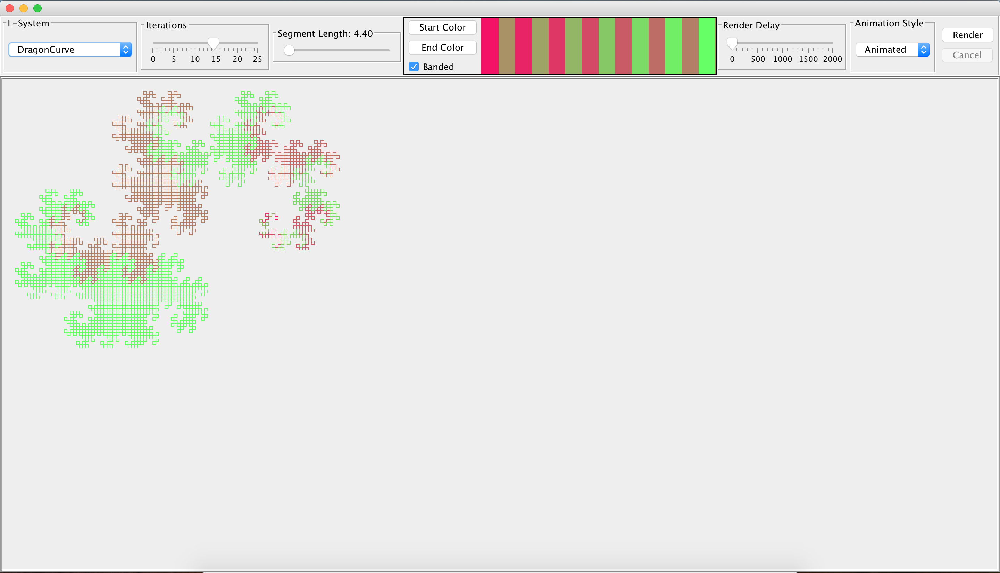
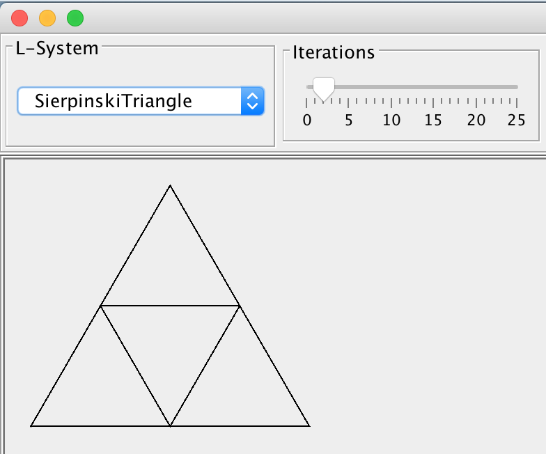

l-systems
=========

Weekend project implementing an L-Systems generator &amp; renderer

Overview
--------

This is a Swing app written in Scala, and serves the primary use of giving me something to hack
on in my downtime while sheltering in place.

I find [L-Systems](https://en.wikipedia.org/wiki/L-system) (or "Lindenmayer system") fascinating,
and have played around with them at various times in the past - partially because the rules engines
to generate them are so much fun to write. This particular go at them is more for my entertainment 
than anything else, so it's a bit rough around the edges.

Notably, the animation appears to have super-linear growth as the number of shapes increases, and 
scrolling gets very slow, very quickly. This is primarily because Swing isn't my area of expertise, 
so the GUI code is probably really cringe-worthy (apologies in advance if you're good at Swing).

Several of the L-Systems invert each iteration, so they don't animate well. Eventually I'll get around
to special-casing these, but for now expect odd rendering for the Sierpinski systems.

My daughter decided it was sufficiently useful justify the time sink, because she figured out how to 
make it generate the Triforce: 

